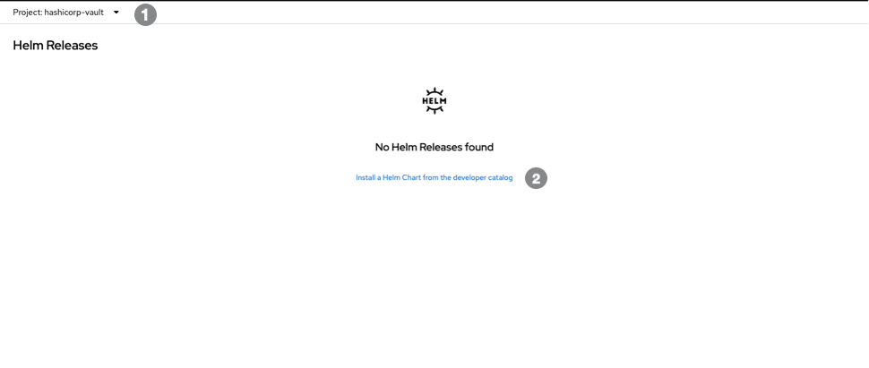

# Building self serving platforms 

The DevOps report 2023 revealed some interesting developments in the evolution of devops as a practice.  Of most signifance was the emergence of the plaform or more specifically  platform engineering. Platform engineering can be generally considered as the development of an infrastructure built around product awareness. It manifests as an ecosystem of self-serving capabilities enabling stream aligned teams to access  IT related services in a frictionless and automated way. Teams are themselves built around product awareness and are aligned towards and organisations vaule streams. The services stream aligned teams consume from platform teams enable increased productivity and better quaility outcomes through  
standardised practices,  

This blog will discuss how self-serving encryption service may be incorporated as a platform service within your organisation or enterprise. The design goal is to address varied governance concerns across business units within the organsation through the imposition of boundaries that  isolate vaults from one another but still remaining within the same overall  . Reducing the cognitive load of platform and value stream teams is also a core design goal as this allows your teams to focus on what matters most, your business.  

Hashicorp Vault is used as an example and I will show it can be integrated into OpenShift to provide encryption as a service to your workloads. The examples in this blog are for demonstrated purposes only and are no way assuming their relevance for any specfic context. They should however be sufficiently adaptable to meet common businss scenarios. 

Enterprise Vault introduced the concept of namespaces, it provides a means to create vaults within vault, each having their own encryption engine and storage backends. We are going to use this feature to create a number of namespaces. The OCP namespace, dedicated to workloads running in OpenShift is the sole focus, the others are purely illustrative, to demonstrate what a self serving capability can achieve.   

1) OCP - A namespace dedicated to workloads running in OpenShift, it will use the  
2) Users - A namespace dedicated to users to store their own key value secrets. They will use the CubbyHole facility and no storage backends. This namespace would probably integrate with an enterprises' internal Identity Management System. 


## Connecting to an external Hashicorp Vault. 


### Installing the Vault agent in OCP.  


###  Head over to the dev console 

 

   namespace from step 1 
 
   select the link 


###  Install the Vault via Helm

 

    search for the vault helm chart 
 
    select the chart repository  
 
  install the vault agent controller 


###  Configure the agent 

 

    select a name for the installation. A `ServiceAccount` will be created using this name and we will reference it later. 

    enter the address of the vault server  

  check the OpenShift box 
 
   enable TLS 
 
   install the controller 


### 5) Verify the installation 

 

  confirm the controller has been deployed 


### Setting up Vault with the CLI.  

Create some environment variables with the Vault address and Vault token 

```
$ export VAULT_ADDR="" 
$ export VAULT_TOKEN=""
```

Create a namespace and set an environment variable. This is a Vault namespace rather than an OpenShift one. You can ignore this step if you are not using Vault Enterprise. 

```
$ vault namespace create ocp   
$ export VAULT_NAMESPACE="admin/ocp" 
```


Enable the kv2 engine and define a path 

```
$ vault secrets enable -path=secrets kv-v2
```

Enable the Kubernetes auth engine:

```
$ vault auth enable admin/ocp/kubernetes
```


Create a secrets: 

```
$ vault kv put secrets/my-app/dev/database username="db-username-retrieved-from-hashi" password="db-password-retrieved-from-hashi"             
```

Verify the secret:

```
$ vault kv get secrets/my-app/dev/database 
```

# for envars example (nodejs-demo)
$ vault kv put secrets/my-app/dev/database username="db-username-retrieved-from-hashi" password="db-password-retrieved-from-hashi"             
$ vault kv get secrets/my-app/dev/database 

# for templates example (hello-world)
$ vault kv put secrets/my-app/dev/contact title="Contact us" telephone="+(44) 555-234545" 
$ vault kv put secrets/my-app/dev/index title="Home page" password="The secret from hashi vault" 

$ vault kv get secrets/my-app/dev/database 


$ oc create secret generic vault-agent-template-web-pages --from-file=index.html.ctmpl=./index.html --from-file=contact.html.ctmpl=./contact.html \
     --dry-run=client -o yaml > vault-agent-template-web-pages.yaml

Define a policy:

```
$ vault policy write my-app-secrets - <<EOF
path "secrets/data/my-app/dev/\*" {
  capabilities = ["read" , "list"]
}
EOF
```

Configure the role:

```
$ vault write auth/kubernetes/role/my-app \
    bound_service_account_names=nodejs-demo-hashi,hello-world-app \
    bound_service_account_namespaces=nodejs-demo,hello-world \
    policies=my-app-secrets \
    ttl=24h
```

In step 3(1) we gave the resource a name. We will now use this name to extract the JWT for the `ServiceAccount`.  
To set up the auth method in Vault using the service account name that was used when initially installed. We need to extract the JWT token from the secret.
Let's find out the name of the secret it is the mountable secret with the vault-token-\* name

```
$ oc describe  sa vault -n hashicorp-vault         
Name:                vault
Namespace:           hashicorp-vault
Labels:              app.kubernetes.io/instance=vault
                     app.kubernetes.io/managed-by=Helm
                     app.kubernetes.io/name=vault
                     helm.sh/chart=vault-0.22.0
Annotations:         meta.helm.sh/release-name: vault
                     meta.helm.sh/release-namespace: hashicorp-vault
Image pull secrets:  vault-dockercfg-flp6c
Mountable secrets:   vault-token-x6hrv
                     vault-dockercfg-flp6c
Tokens:              vault-token-4ltc7
                     vault-token-x6hrv
Events:              <none>
```

Next export the JWT token, the Kubernetes API CA certificate and the Kubernetes endpoint address: 

```
$ export JWT_TOKEN=$(oc get secret vault-token-x6hrv -n hashicorp-vault -o jsonpath='{.data.token}' | base64 -d)
$ export KUBE_CA_CRT=$(oc get cm kube-root-ca.crt -n openshift-config -o jsonpath='{.data.ca\.crt}') 
$ export KUBE_HOST=$(oc config view --raw --minify --flatten --output 'jsonpath={.clusters[].cluster.server}')
```

Use these variables to write auth config to Vault: 

```
$ vault write auth/kubernetes/config \
     token_reviewer_jwt="$JWT_TOKEN" \
     kubernetes_host="$KUBE_HOST" \
     kubernetes_ca_cert="$KUBE_CA_CRT" 
```

Verify the config: 

```
$ vault read auth/kubernetes/config
```