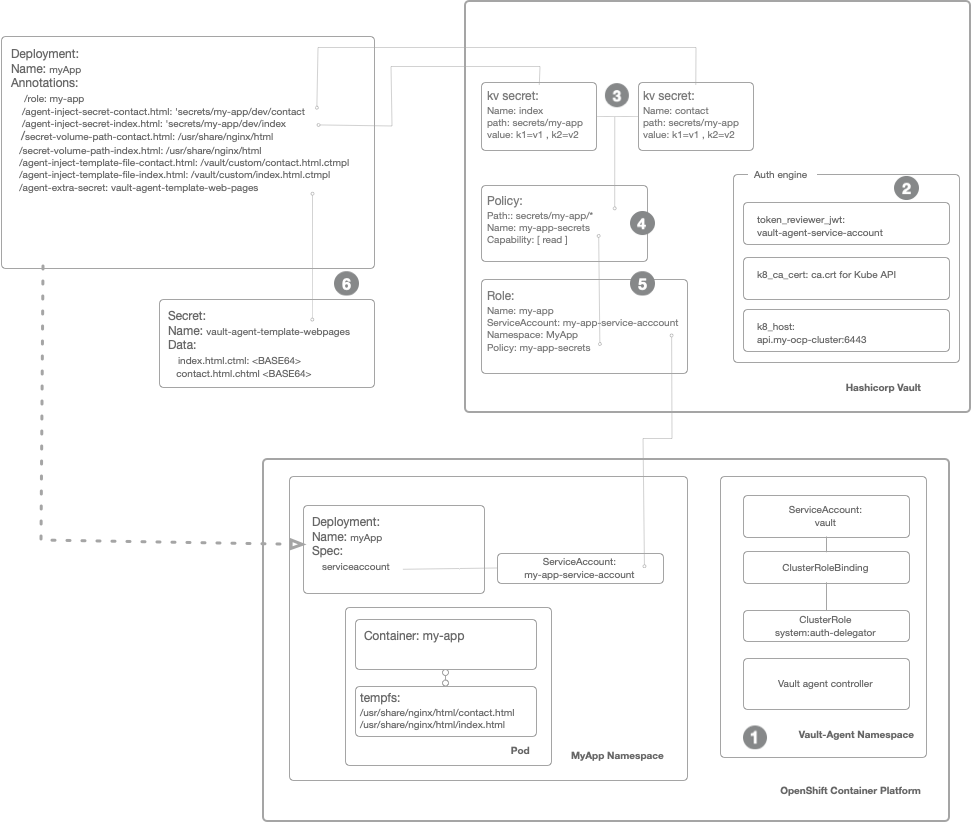

# Building self serving platforms 

The [State of DevOps report 2023](https://www.puppet.com/resources/state-of-platform-engineering) from Puppet Labs revealed some interesting developments in the evolution of devops as a practice.  A signifant finding was the emergence of the plaform or more specifically platform engineering. Platform engineering can be generally considered as the development of a product aware infrastructure that provisions self service capbilities. Platform teams continually adapt and evolve those services and enable stream aligned teams to access those service in a frictionless and automated way. Teams consuming the platform  are also aligned to the organisations vaule streams. The business outcome tends towards increased productivity through standardised practices, less work duplication, better security and ultimately, a better quality product.  

This blog demonstrates with exmaples how a self-serving encryption service may be incorporated as a platform service within your organisation or enterprise. The design goal is to address varied governance concerns across business units within the organsation through the imposition of boundaries that  isolate vaults from one another whilst remaining within the same overall deployment. By creating low resistance interaction between platform and stream aligned teams, the cognitive load of both is reduced therby permitting teams to focus on what matters most, the business.  

[Hashicorp Vault](https://www.hashicorp.com/products/vault) is the use case. The integration section below will show how it can be integrated into [OpenShift Container Platform](https://www.redhat.com/en/resources/red-hat-openshift-overview) from [Red Hat](https://redhat.com) to provide encryption as a service to your workloads. The examples in this article are for demonstrated purposes only and are in no way assuring relevance for any context. They should however be sufficiently adaptable to meet many businss scenarios. 

Enterprise Vault introduced the concept of namespaces, it provides a means to create vaults within vault, each having their own encryption engine and storage backends. We are going to use this feature to create a number of namespaces. However, the OCP namespace in Vault, dedicated to workloads running in OpenShift is the sole focus. The others are purely illustrative, to demonstrate what a self serving capability can achieve.   

1) OCP - A namespace dedicated to workloads running in OpenShift. 
2) Users - A namespace dedicated to users to store their own key value secrets. They will use the CubbyHole facility and no storage backends. This namespace would probably integrate with an enterprises' internal Identity Management Provider (IDP). 
3) Legal - A namespace dedicated to users within a legal department. They could use a different or the same IDP as the User namespace. 

A basic nginx webserver will be used as an example deployment to demonstrate the integration with Vault. The app will use templates to create html files that can be mounted as files and made availble to the webserver. The code for the application can be retrieved from: 

To follow this you will need to the following: 

* A Hashicorp Vault Enterprise cloud account. Sign up for a free trial and receive $50 credit in your account. You can use this to install a Development Small cluster. The budget should last around two months depending on your region and usage. 
* An OpenShift account with sufficient permissions to install the agent and `ClusterRoleBindings`

## Vault CLI config 

(i) Ensure that you have the Vault CLI installed and that you connect to the Vault server. Set up the following environment variables. 

```
export VAULT_ADDR="https://your-vault-address:8200"
export VAULT_TOKEN="the-token"

```

(ii) Create a namespace in Vault and set an environment variable to use the name space for subsequent commands issued using the Vault CLI. 

```
$ vault namespace create ocp   
$ export VAULT_NAMESPACE="admin/ocp" 
```

Let's start!  

## The big picture 

 


  *Install the Vault Agent in OpenShift* 

Refer to [install agent guid](install-agent.md) 


  *Setting up the Kubernetes Auth method*

(i) Enable the Kubernetes Auth engine in Vault. Use the Vault CLI. 

```
$ vault auth enable kubernetes
```

(ii) Obtain the JWT token fom the Vault `ServiceAccount`. Use the `oc` command. 
```
$ oc describe  sa vault -n hashicorp-vault         
Name:                vault
Namespace:           hashicorp-vault
Labels:              app.kubernetes.io/instance=vault
                     app.kubernetes.io/managed-by=Helm
                     app.kubernetes.io/name=vault
                     helm.sh/chart=vault-0.22.0
Annotations:         meta.helm.sh/release-name: vault
                     meta.helm.sh/release-namespace: hashicorp-vault
Image pull secrets:  vault-dockercfg-flp6c
Mountable secrets:   vault-token-x6hrv
                     vault-dockercfg-flp6c
Tokens:              vault-token-4ltc7
                     vault-token-x6hrv
Events:              <none>
```

(iii) Place the JWT token for the secret vault-token-x6hrv into an environment variable. Use the `oc` command. 

```
$ export JWT_TOKEN=$(oc get secret vault-token-x6hrv -n hashicorp-vault -o jsonpath='{.data.token}' | base64 -d)
```

(iv) Add the Kubernetes API CA and the Kubernetes API endpoint to some environment variables. Use the `oc` command. 

```
$ export KUBE_CA_CRT=$(oc get cm kube-root-ca.crt -n openshift-config -o jsonpath='{.data.ca\.crt}') 
$ export KUBE_HOST=$(oc config view --raw --minify --flatten --output 'jsonpath={.clusters[].cluster.server}')
```

(v) Create the auth configuration within Vault. Use the Vault CLI 


```
$ vault write auth/kubernetes/config \
     token_reviewer_jwt="$JWT_TOKEN" \
     kubernetes_host="$KUBE_HOST" \
     kubernetes_ca_cert="$KUBE_CA_CRT" 
```

(vi) Verify the config. Use the Vault CLI

```
$ vault read auth/kubernetes/config
```

 *Create the secrets* 


(i) Enable the kv2 secrets engine. Use the Vault CLI 

```
$ vault secrets enable -path=secrets kv-v2
```

(ii) Write two secrets to the vault. These will represent content for our HTML pages. Use the Vault CLI. 

```
$ vault kv put secrets/my-app/dev/contact title="Contact us" telephone="+(44) 555-234545" 
$ vault kv put secrets/my-app/dev/index title="Home page" password="The secret from hashi vault" 
```

(iii) Verify the secrets. Use the Vault CLI. 

```
$ vault kv get secrets/my-app/dev/contact 
$ vault kv get secrets/my-app/dev/index 
```

  *Create a policy*  

(i) Create a policy that defines access to the secrets. Use the Vault CLI 


```
$ vault policy write my-app-secrets - <<EOF
path "secrets/data/my-app/dev/\*" {
  capabilities = ["read" , "list"]
}
EOF
```

 *Create a role*  

(i) A role associates a `ServiceAccount` and `NameSpaces` to a policy. Use the Vault CLI. 


```
$ vault write auth/kubernetes/role/my-app \
    bound_service_account_names=hello-world-app \
    bound_service_account_namespaces=hello-world \
    policies=my-app-secrets \
    ttl=24h
```


  *OpenShift Deployment* 


(i) Create templates to be rendered into html files containing the secrets from Vault. Use a text editor for this. 

(ii) Create a secret to contain those files within Kubernetes. Use the `oc` command. 

```
$ oc create secret generic vault-agent-template-web-pages --from-file=index.html.ctmpl=./index.html --from-file=contact.html.ctmpl=./contact.html \
     --dry-run=client -o yaml > vault-agent-template-web-pages.yaml
```

(iii) Apply the Vault annotations to the OpenShift deployment. 

```
annotations: 
    vault.hashicorp.com/namespace: admin/ocp
    vault.hashicorp.com/agent-inject: 'true'
    vault.hashicorp.com/agent-pre-populate-only: 'true'
    vault.hashicorp.com/auth-path: 'auth/kubernetes'
    vault.hashicorp.com/role: 'my-app'    
    # this is a secret stored in vault 
    vault.hashicorp.com/agent-inject-secret-index.html: 'secrets/my-app/dev/index'
    vault.hashicorp.com/agent-inject-secret-contact.html: 'secrets/my-app/dev/contact'
    # this path to be rendered 
    vault.hashicorp.com/secret-volume-path-index.html: /usr/share/nginx/html
    vault.hashicorp.com/secret-volume-path-contact.html: /usr/share/nginx/html
    # this is the k8s secret that contains the templates which the agent combines using the vault secrets
    vault.hashicorp.com/agent-extra-secret: vault-agent-template-web-pages 
    # this tells vault where to load the template so it can get rendered 
    vault.hashicorp.com/agent-inject-template-file-contact.html: /vault/custom/contact.html.ctmpl
    vault.hashicorp.com/agent-inject-template-file-index.html: /vault/custom/index.html.ctmpl


```
