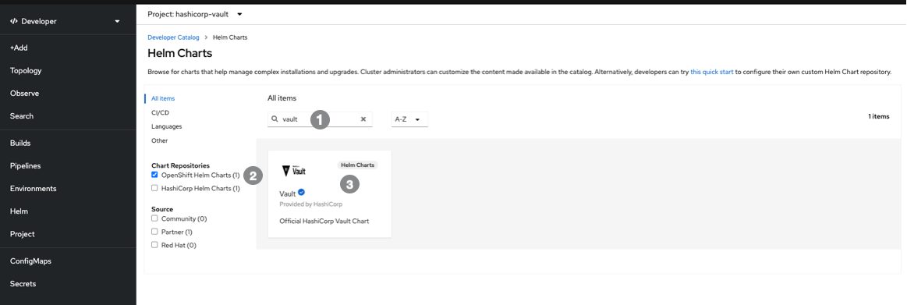
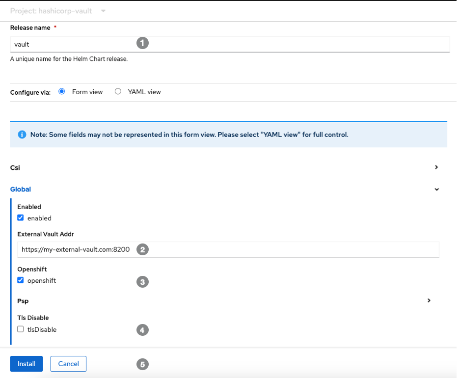
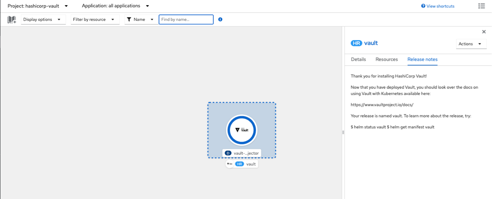

# Installing the Vault agent in OCP.  


## Create a namespace that will host the agent controller. Use the `oc` command. 

```
oc create namespace hashicorp-vault 
```

## Head over to the OpenShift developer console 

 

   `Namespace` from step 1.
 
   Select the link.


## Install the Vault via Helm

 

    Search for the vault helm chart.
 
    Select the chart repository.  
 
  Install the vault agent controller.


## Configure the agent 

 

    Select a name for the installation. A `ServiceAccount` will be created using this name and we will reference configuring the Kubernetes Auth method. 

    Enter the address of the vault server.

  Check the OpenShift box.
 
   Enable TLS 
 
   Install the controller. 


## Verify the installation 

 

  Confirm the controller has been deployed.
